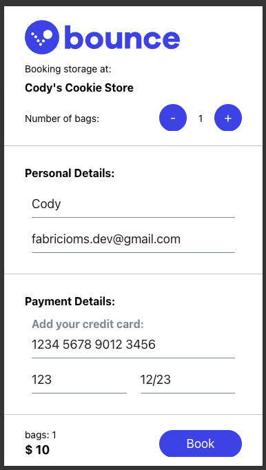
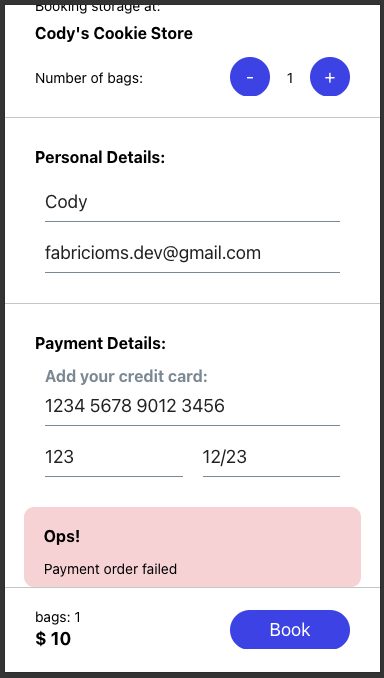

# Bag Storage Checkout App

"Bag Storage Checkout App" is a simple web application that allows users to store their bags in a storage facility and retrieve them later. The application is built using React Native, Expo and Redux.

<div style="display:flex;">
        
                
        
        
</div>

## How to setup:
````bash
  make setup
````

## How to run:
````bash
   make run
````
## How to test:
````bash
   make test
````
